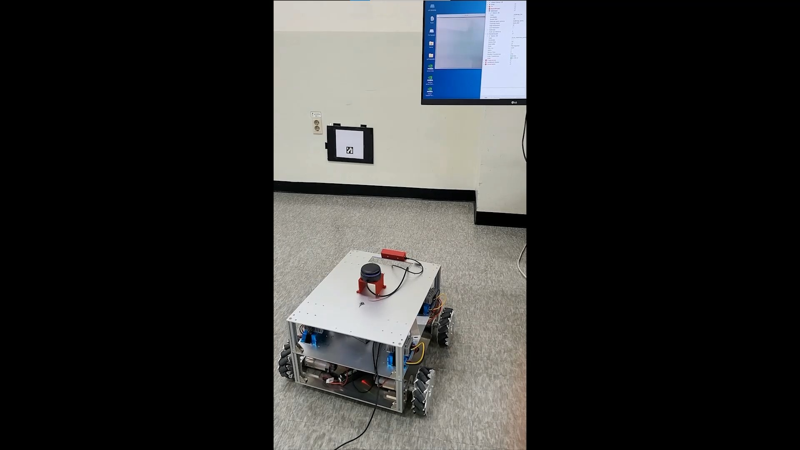

# Auto-Docking-ROS
Mobile Robot Docking System package using ArUco Marker.

## 🛠️Introduction  
* Package for Autonomous Mobile Robot Docking System using RGB-D camera and ArUco Marker. ([Test : https://www.youtube.com/watch?v=wxZ-b0o1vn4](https://www.youtube.com/watch?v=wxZ-b0o1vn4))  
* PD Position Control
* It is used in the robot's automatic charging system.
* Detail in this [Repository](https://github.com/SanghyunPark01/2022-Share_Robot_Contest)

## 🛠️Prerequisites  

### **OpenCV**
I use [OpenCV](https://opencv.org/) to manipulate images and ArUco Marker. Download and Install : [OpenCV](https://github.com/opencv/opencv), [OpenCV_Contrib](https://github.com/opencv/opencv_contrib) (at least 4)
### **Boost**
ROS message filter needs [Boost](https://www.boost.org/)
### **RealSense SDK**
I use [Realsense SDK](https://github.com/IntelRealSense/librealsense) to use Realsense D435. Download and Install : [librealsense](https://github.com/IntelRealSense/librealsense)
### **ROS**
Install [ROS](http://wiki.ros.org/noetic/Installation/Ubuntu) (I installed ros noetic)
### **Additional**
* [realsense ros](https://github.com/IntelRealSense/realsense-ros)
* ros : std_msgs, sensor_msgs, geometry_msgs, cv_bridge ... 
## 🛠️Setting

* **Development environment**

|Settings|Version|
|:---:|:---:|
|OS|Ubuntu 20.04|
|Language|C++|
|ROS|Noetic|
|IDE|VS code|
|OpenCV|4.4.0|
|Camera|Intel Realsense D435| 
|Realsense SDK|2.51.1| 

* **Test environment**

|Settings|Version|
|:---:|:---:|
|OS|Ubuntu 20.04|
|JetPack|5.0.2|
|Language|C++|
|ROS|Noetic|
|OpenCV|4.4.0|
|Camera|Two Camera : Intel Realsense D435|
|Realsense SDK|2.51.1|  

## 🛠️Parameter Tuning  
### Control Gain
Top of `src/ControlSystem.cpp`, you can change Reference and Gain.(`#define ~`)  

### Limit Velocity
Top of `src/mode.cpp`, you can change Limit Angular and Linear Velocity.(`#define~`)  

### Allowable Error
Top of `src/controller.cpp`, you can change Allowable Error.(`#define~`)

## 🛠️Branch  
* `main` : main branch is main source code.
* `robot_test` : robot_test branch is source code that I use my Robot.

## 🛠️Build  
Clone the repository:  
```
cd (your_workspace)/src
```  
Build:  
```
git clone https://github.com/SanghyunPark01/Auto-Docking-ROS.git
cd ~/(your_workspace)
catkin_make
```

## 🛠️Run  
* **STEP 1** :  
  In [`docking_main_node.cpp`](https://github.com/SanghyunPark01/Auto-Docking-ROS/blob/8ae13fe07a070c190b01b54cffa3e548c3e01acd/src/docking_main_node.cpp#L38), you have to publish `/check_DockingSystem_Flag`. If you want this, you have to erase [\`//\` in docking_main_node.cpp - line 64](https://github.com/SanghyunPark01/Auto-Docking-ROS/blob/8ae13fe07a070c190b01b54cffa3e548c3e01acd/src/docking_main_node.cpp#L64)
* **STEP 2** :  
  ```
  roslaunch realsense2_camera rs_camera.launch
  rosrun Auto-Docking-ROS docking_full
  ```
## 🛠️Test  

**Click Image!!**
[](https://www.youtube.com/watch?v=wxZ-b0o1vn4)

## 🛠️Error Reporting  

* Using github issues  
* Or Sending me an E-mail : pash0302@naver.com